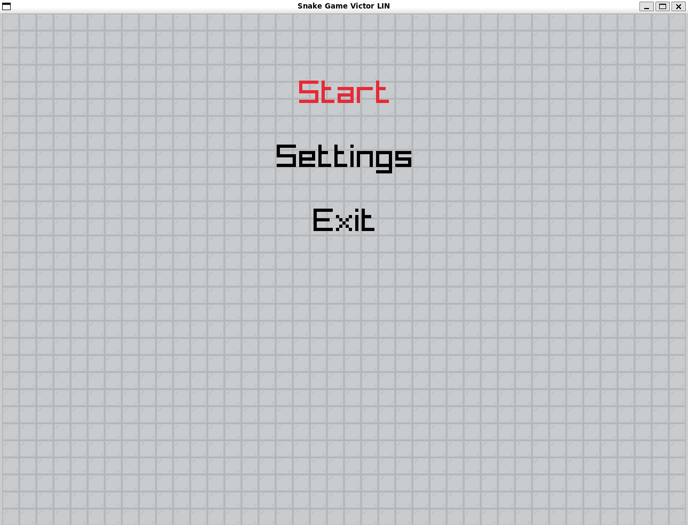
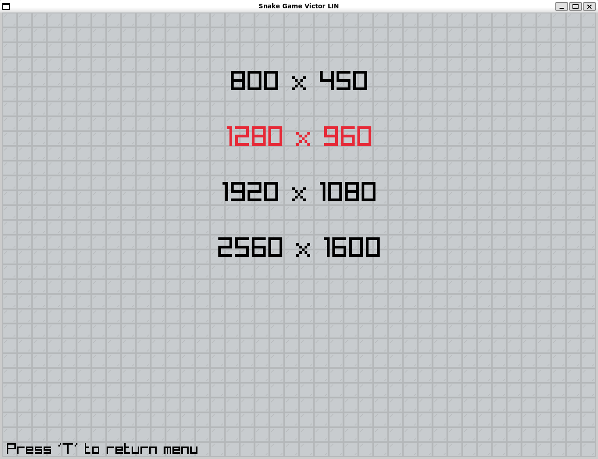
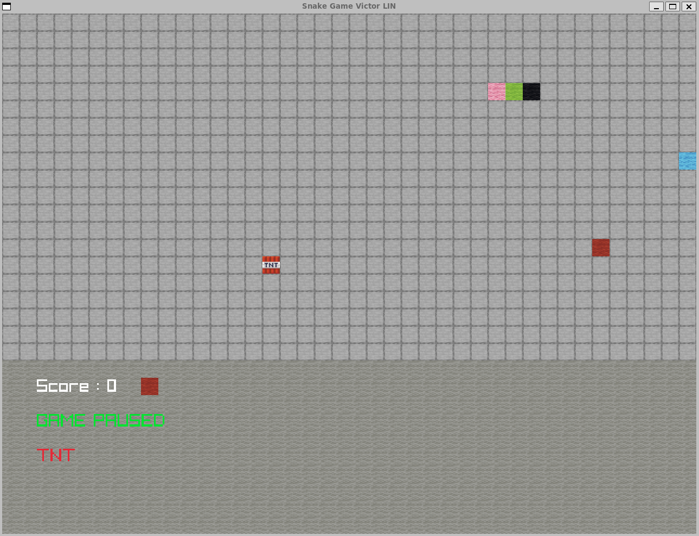
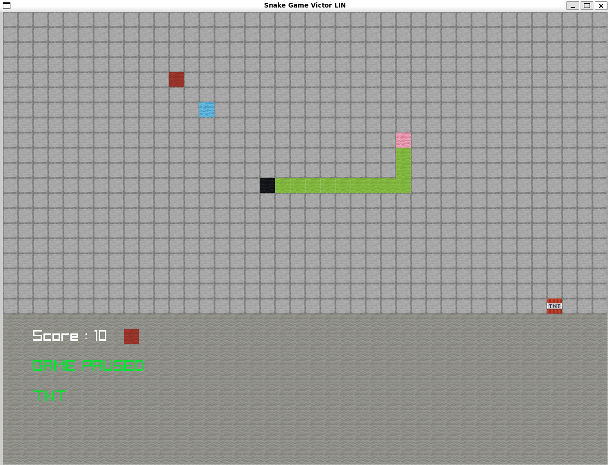
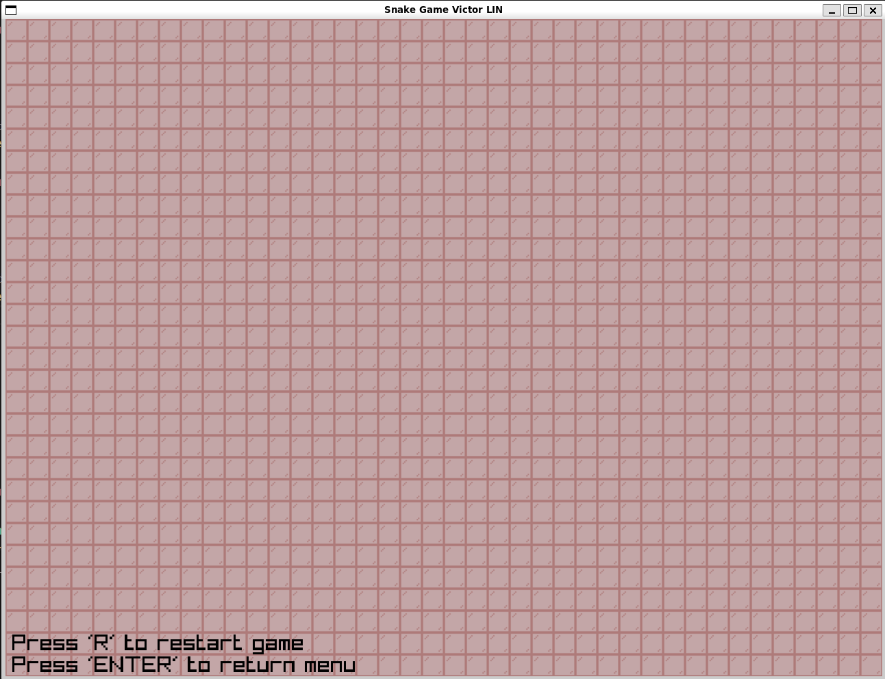

## Classic Game - Snake

### Screen Shot

### Video

### Description
The game has been create by Raylib on C

### Features
 - Resolution
 - ...

### Controls

Keyboard:
 - ENTER -> Select the menu.
 - R -> Restart (on Game Over menu !).
 - T -> Back to menu (on Settings menu !).
 - P -> Game Pause (on Game Screen menu !).
 - UP/Z DOWN/S LEFT/Q RIGHT/D -> Move the player.